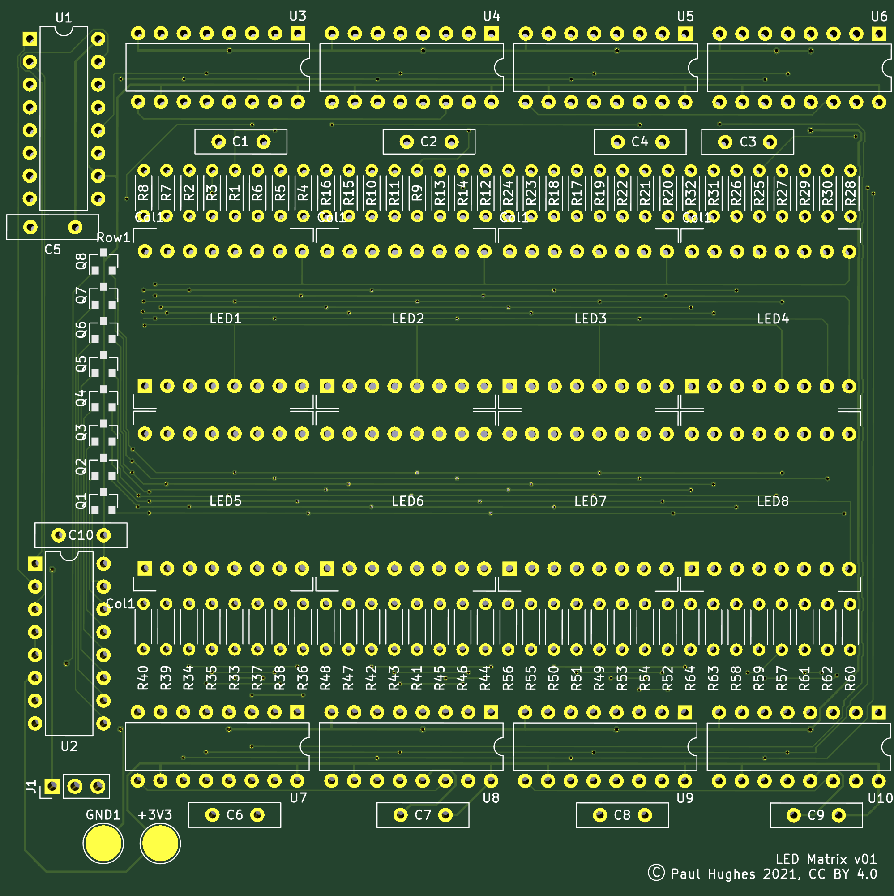

# 32x16 LED Array PCB using 788BS

KiKad files for the design of an LED matrix. The board has been manufactured by PCB and is
working.

While physically a 16 row and 32 column design, it is logically organised as 8 rows and 64
columns. Logical row N drives physical rows N and N+8.

Uses a 3-pin header to drive a series of 74HC595 shift registers. First shift register is connected to a 
74HC238 3-to-8 decoder to provide hardware enforced one-hot enable of rows. Rows are driven by a PMV16XN 
SMT power MOSFET to provide enough current to drive 32 LED columns.

Another eight 8-bit shift registers provide control over the 64 columns, with each column
using a 680 ohm resistor to limit current. Brightness of individual LEDs can be supported
externally by reprogramming the shift register and pulse-width-modulating the on-time for
each column.

## Notes

Board layout is intended for manufacture by PCB Way.

Take care with 788BS parts, I recommend testing them before soldering onto the board. 
The first board I've built has a short circuit inside one of 788BS components, are these 
are difficult to remove as the pins are underneath the package.

## Errata

v01 of the board transposed rows 5 and 6 on the included 788BS symbol. This can be resolved
by transposing the data for these rows in software before driving the serial interface.

## Future

I plan to C drivers for Paspberry Pi Pico. Eventually I plan to migrate the IO the Pico's
programmable IO.

